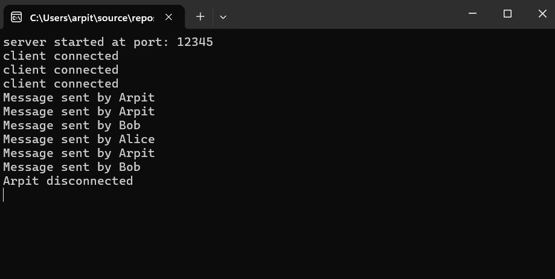
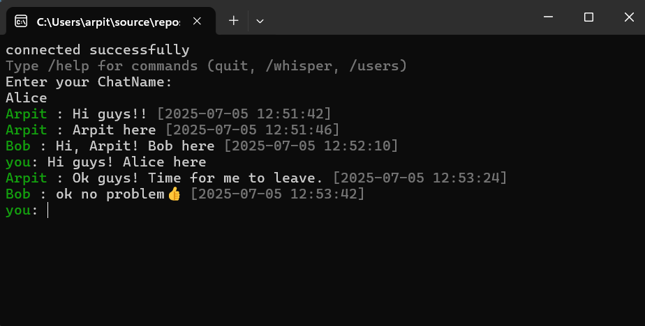

# 💬 C++ Console Chat Application

<div align="center">


**A real-time terminal-based chat application built with C++ and Winsock**

*Connect multiple clients to a central server for seamless group messaging*

[Features](#-features) • [Installation](#-installation) • [Usage](#-usage) • [Demo](#-demo) • [Screenshots](#-screenshots)

</div>

---

## ✨ Features

### 🌐 **Multi-Client Support**
- **Connect multiple users simultaneously** - Support for concurrent connections
- **Real-time message broadcasting** - Instant message delivery to all connected clients
- **Concurrent connection handling** - Thread-based architecture for smooth performance

### ⚡ **Performance & Reliability**
- **TCP socket communication** - Reliable data transmission using Winsock2
- **Multi-threaded architecture** - Separate threads for sending and receiving messages
- **Graceful error handling** - Proper connection management and error recovery

### 🎨 **Rich User Experience**
- **Color-coded usernames** - Visual distinction between different users
- **Timestamp on every message** - Track conversation flow with precise timing
- **Emoji and UTF-8 support** - Express yourself with emojis and special characters
- **Clean console interface** - Intuitive and user-friendly terminal experience

### 🔧 **Easy to Use**
- **Simple setup process** - Quick compilation and execution
- **Intuitive commands** - Easy-to-remember chat commands
- **Cross-session compatibility** - Seamless reconnection capabilities

---

## 🛠️ Tech Stack

| Component | Technology |
|-----------|------------|
| **Language** | C++17 |
| **Networking** | Winsock2 API |
| **Platform** | Windows Console |
| **Concurrency** | `std::thread` |
| **Time Handling** | `<ctime>`, `strftime` |

---

## 📁 Project Structure

```
cpp-chat-app/
├── 📄 README.md
├── 📄 LICENSE
├── 📄 .gitignore
├── 🗂️ ServerSide/
│   ├── ServerSide.sln
│   ├── ServerSide.vcxproj
│   └── server.cpp
└── 🗂️ ClientSide/
    ├── ChatClient.sln
    ├── ChatClient.vcxproj
    └── client.cpp
```

---

## 🚀 Installation

### Prerequisites
- Windows 10/11
- Visual Studio 2019 or later
- C++17 compiler support

### Quick Start

1. **Clone the repository**
   ```bash
   git clone https://github.com/yourusername/cpp-chat-app.git
   cd cpp-chat-app
   ```

2. **Build the Server**
   ```bash
   cd ServerSide
   # Open ServerSide.sln in Visual Studio and build
   ```

3. **Build the Client**
   ```bash
   cd ClientSide
   # Open ChatClient.sln in Visual Studio and build
   ```

---

## 🎯 Usage

### Starting the Server

1. Navigate to the `ServerSide` directory
2. Run the server executable
3. Server will start listening on **port 12345**

```
🖥️ Server Console Output:
Server started on port 12345
Waiting for connections...
Client connected from 127.0.0.1:54321
```

### Connecting Clients

1. Run the client executable
2. Enter your username when prompted
3. Start chatting!

```
💬 Client Console:
Enter your name: John
Connected to server!
John: Hello everyone! 👋 [2025-07-05 12:34:56]
```

### Chat Commands

| Command | Description |
|---------|-------------|
| `quit` | Exit the chat gracefully |
| `Windows + .` | Open emoji picker (Windows) |
| Regular text | Send message to all connected users |

---

## 🎬 Demo

> *A live demonstration of multiple clients chatting in real-time*

[](https://www.youtube.com/watch?v=your_video_id_here)

### Sample Chat Session
```
Alice: Good morning everyone! ☀️ [2025-07-05 09:15:23]
Bob: Hey Alice! How's everyone doing? [2025-07-05 09:15:45]
Charlie: Great to see you all here! 🎉 [2025-07-05 09:16:02]
```

---

## 📸 Screenshots

<div align="center">

| Server Console | Client Console |
|:--------------:|:--------------:|
|  |  |
| *Server managing multiple connections* | *Client interface with multiple users* |

</div>

---

## 🔧 Configuration

### Network Settings
- **Default Port**: 12345
- **Protocol**: TCP
- **Max Connections**: 10 (configurable)

### Customization Options
- Modify username colors in `client.cpp`
- Adjust message buffer size in server configuration
- Change timestamp format in message handling

---

## 📋 Future Enhancements

- [ ] Cross-platform support (Linux, macOS)
- [ ] Cloud Deployment
- [ ] GUI version using Qt or similar
- [ ] File transfer capabilities
- [ ] Message encryption
- [ ] User authentication
- [ ] Chat rooms/channels
- [ ] Message history persistence

---

## 🐛 Known Issues

- Windows Firewall may block connections (add exception)
- Large messages (>1024 bytes) may be truncated
- Server doesn't persist chat history between sessions

---


<div align="center">

**Made with ❤️ by Arpit Kumar**

*If this project helped you learn something new, please consider giving it a ⭐!*

[](https://github.com/arpitkumar0007/cpp-chat-app/stargazers)
[](https://github.com/arpitkumar0007/cpp-chat-app/network/members)

</div>
